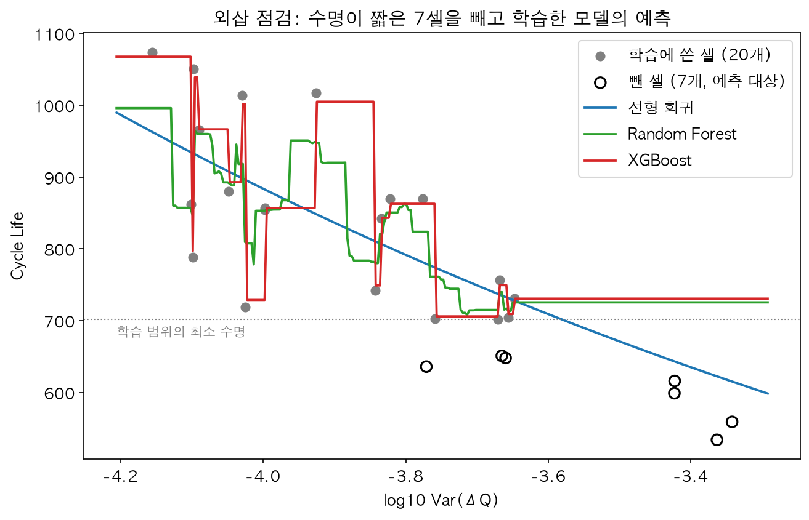
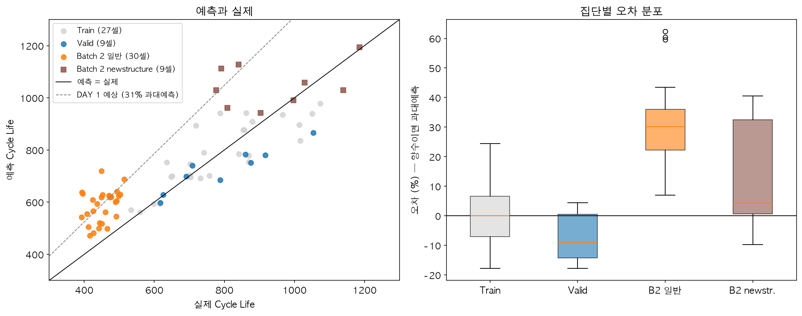

# ESS 배터리 수명 예측

초기 100사이클의 측정 데이터만으로 리튬이온 배터리 셀의 총 수명(cycle life)을 예측한다.
배터리 교체 비용은 ESS CAPEX의 30~40%를 차지하므로, 수명을 초기에 알 수 있으면 교체 시점을 미리 계획하고 셀을 선별할 수 있다.

**결과 요약**

- 모델은 `log10 Var(ΔQ)` 피처 하나를 쓰는 선형 회귀다. 피처와 모델은 EDA 결과에서 정했고, Batch 1 안의 교차검증으로 확정했다.
- Test(Batch 2) MAPE는 **26.66%**로 원 논문의 9.1%에 미치지 못한다. 같은 배치 안의 Hold-out에서는 8.71%, 시험 조건이 비슷한 Batch 3에서는 12.50%다.
- Test 오차의 대부분은 Batch 2 일반 30셀의 과대예측(편향 +29.15%)이다. 이 집단은 휴지 시간이 학습 배치와 다르며, EDA 단계에서 약 31%의 과대예측을 미리 예상했다.
- 학습 배치에 시험 조건의 변동이 없어 Batch 1만으로는 이 편향을 줄일 수 없다. 모델이나 피처를 바꿔서 해결되는 오차가 아니다.


## 프로젝트 개요

- 데이터셋 : MIT-Stanford Battery Dataset (Severson et al., Nature Energy 2019)
- 학습 데이터 : Batch 1 (2017-05-12)
- 평가 데이터 : Batch 2 (2018-02-20), 추가 평가 Batch 3 (2018-04-12)
- 태스크 : Regression (Cycle Life 예측), 타깃은 `log10(cycle_life)`
- 평가 지표 : MAPE

| 역할 | 배치 | 전체 셀 | 분석 대상 | 수명 범위 | 수명 중앙값 |
|---|---|---:|---:|---:|---:|
| 학습 | Batch 1 | 46 | 36 | 534~1,074 | 772.5 |
| 평가 | Batch 2 | 47 | 39 | 392~1,186 | 472 |
| 추가 평가 | Batch 3 | 46 | 44 | 541~1,935 | 1,005.5 |

분석 대상은 수명 값이 있고, 마지막 방전 용량이 EOL(0.88Ah, 공칭 1.1Ah의 80%)에 도달한 것을 데이터로 확인한 셀이다.


## 파일 구조

```
├── data/
│   └── README.md                     # 데이터 받는 곳, 가공 캐시 만드는 방법
├── notebooks/
│   ├── 01_EDA.ipynb                  # 데이터 정제, EDA 질문 5개
│   ├── 02_feature_engineering.ipynb  # 정제·피처 함수 작성과 EDA 값 대조
│   └── 03_modeling.ipynb             # 분할, 모델 비교, 평가, 오류 분석
├── src/
│   ├── preprocess.py                 # 로딩, 셀 선별, 방전 용량 정제
│   ├── features.py                   # ΔQ(V) 피처, 용량 기울기 피처
│   └── train.py                      # 분할, 교차검증, 평가, 성능 표 저장
├── results/
│   ├── model_performance.csv         # 성능 표 (과제 형식)
│   ├── performance_by_group.csv      # 집단별 MAPE와 편향
│   └── figures/
├── requirements.txt
└── README.md
```


## 환경 설정

```bash
git clone https://github.com/kyubin0973/DA-mini.git
cd DA-mini
python -m venv .venv && source .venv/bin/activate
pip install -r requirements.txt
```

Python 3.11에서 작업했다. 데이터 파일을 받아 두는 방법은 [data/README.md](data/README.md)에 있다.

```bash
python -c "from src.preprocess import build_cache; build_cache('data', 'data/processed')"   # 가공 캐시 생성 (최초 1회)
python -m src.train                                                                          # 성능 표 재생성
```


## EDA

전체 과정과 수치는 [notebooks/01_EDA.ipynb](notebooks/01_EDA.ipynb)에 있다.

### 데이터 정제

- Batch 1의 46셀 중 10셀은 EOL에 도달하지 않은 채 시험이 끝났다. 마지막 용량이 0.913~1.043Ah이고, 기록된 `cycle_life`가 측정 사이클 수 + 1과 같았다. 수명이 아니라 시험 종료 시점이므로 제외했다.
- 방전 용량은 0.8~1.15Ah 밖의 59행과, 주변 11사이클 중앙값에서 0.04Ah 넘게 벗어난 11행을 제외했다. 두 기준 모두 값이 없는 빈 구간 안에 두었다.
- ΔQ(V) 곡선에는 전압 축 9포인트 중앙값 필터를 적용했다. 한 점짜리 스파이크 때문에 곡선의 최솟값이 −0.0936Ah로 계산된 셀이 있었다(필터 후 −0.0279Ah).
- 핵심 발견 : **제공된 수명 값을 그대로 쓸 수 없다. 검증을 통과한 분석 대상은 119셀이다.**

### Cycle Life 분포


- 세 배치의 분포가 다르다(중앙값 772.5 / 472 / 1,005.5).
- Batch 2는 두 집단의 혼합이다. 일반 30셀은 392~514, `newstructure` 9셀은 777~1,186으로 범위가 겹치지 않는다.
- 분류 기준 550사이클 미만인 셀이 Batch 1에는 36셀 중 1개, Batch 2에는 39셀 중 30개다.
- 핵심 발견 : **평가 배치의 일반 30셀은 전부 학습 배치의 수명 범위 밖에 있다.** 분류는 학습할 수 없고, 학습 범위 밖을 예측할 수 있는 회귀 모델이 필요하다.

### 열화 곡선 분석


- 열화 속도는 일정하지 않다. knee 이후 약 9~11배 빨라진다.
- knee는 수명의 약 70% 지점에 있다(배치별 중앙값 0.71 / 0.69 / 0.76). 가장 이른 knee가 243사이클이다.
- 장수명 vs 단수명 : 단수명 셀(<500, 28셀)은 장수명 셀(>1,000, 31셀)보다 knee 이전 열화 속도가 약 2배(0.107 / 0.055mAh/사이클), knee 이후가 약 2.4배(1.227 / 0.511) 빠르다. 배치 안에서도 knee 이후 속도와 수명의 상관이 −0.74~−0.84다.
- 그러나 초기 100사이클의 용량 변화는 중앙값 +0.0014~+0.0024Ah로 사이클 간 변동 수준이다. 전체 수명에 걸친 속도 차이가 이 구간의 용량 값에는 드러나지 않는다.
- 핵심 발견 : **초기 100사이클의 용량 값에는 수명 신호가 없다.** 용량의 크기가 아니라 방전 곡선의 모양 변화에서 신호를 찾아야 한다.

### ΔQ(V) 곡선 분석


- ΔQ(V) = Q₁₀₀(V) − Q₁₀(V). 수명이 짧은 셀일수록 곡선이 깊게 파인다.
- `log10 Var(ΔQ)`와 `log10(수명)`의 상관이 Batch 1 −0.84, Batch 2 일반 −0.38, Batch 3 −0.76이다.
- Batch 1에서 관계는 로그-로그 직선이다(`log_life = −0.300 × log_var + 1.752`).
- Batch 2 일반 30셀은 이 직선보다 아래에 있다. 실제 수명이 직선 예측의 약 76%다. 이 집단은 휴지 시간이 약 5분으로 Batch 1(약 1분)과 다르다.
- 핵심 발견 : **`log Var(ΔQ)`가 수명과 가장 강하게 연관되지만, 집단에 따라 직선의 위치가 다르다. Batch 1로 학습한 모델은 Batch 2 일반 셀에서 약 31% 과대예측할 것으로 예상했다.**

### 충전 속도(C-rate)와 수명의 관계


- 평균 충전 속도가 다양한 것은 Batch 1뿐이다(4.00~5.40C). 나머지 집단은 4.79~4.81C로 사실상 고정이다.
- Batch 1에서 평균 충전 속도와 수명의 상관은 −0.59이지만, 가장 빠른 두 셀을 빼면 −0.45다.
- 같은 평균 충전 속도에서 수명이 약 390~1,930으로 5배 가까이 차이 난다.
- 핵심 발견 : **"고속 충전 셀이 수명이 짧다"는 Batch 1 안에서만 확인된다.** 충전 조건은 평가 배치에서 셀을 구분하지 못하므로 피처로 쓰지 않는다.

### 상관관계와 다중공선성


- 초기 100사이클로 만든 피처 16개를 세 기준으로 판정했다: 학습 배치에서의 상관, 다른 집단 안에서의 방향, 집단 사이의 관계.
- 충전 속도와 충전 시간은 Batch 1에서 상관이 높지만 다른 집단에서 부호가 다르다. `qd_100`은 집단 안에서는 양의 상관인데 집단 사이에서는 관계가 반대다.
- ΔQ 피처끼리는 상관이 0.98~1.00이다.
- 핵심 발견 : **세 기준을 모두 통과한 것은 ΔQ 피처뿐이고, 그중 하나만 쓰면 된다.**


## Modeling

전체 과정은 [notebooks/02_feature_engineering.ipynb](notebooks/02_feature_engineering.ipynb), [notebooks/03_modeling.ipynb](notebooks/03_modeling.ipynb)에 있다.

### 피처 엔지니어링 전략

| 피처 | 판정 | 근거 |
|---|---|---|
| `log_var` = log10 Var(Q₁₀₀ − Q₁₀) | **채택** | 수명과의 상관이 가장 강하고(−0.84) 세 집단에서 방향이 같다 |
| `qd_slope_last` (91~100사이클 용량 기울기) | 후보 → **제외** | 교차검증에서 검증 MAPE가 9.46% → 10.19%로 나빠졌다 |
| `log_min`, `log_mean` | 제외 | `log_var`와 같은 정보(0.98~1.00) |
| 용량 수준, 용량 변화 | 제외 | 집단 사이에서 관계가 반대이거나 잡음 수준 |
| 충전 정책, 충전 시간 | 제외 | 평가 배치에서 변동이 없고 집단마다 방향이 다름 |
| 온도, 내부 저항 | 제외 | 상관이 약하고 측정 오류와 결측이 있음 |

정제와 피처 계산은 `src/`의 함수로 만들었고, 함수의 결과가 EDA에서 구한 값과 119셀 모두 일치하는 것을 확인했다. 피처 함수는 수명 값을 쓰지 않으므로 학습 배치와 평가 배치에 똑같이 적용된다.

### 데이터 분할

| 구분 | 셀 | 방법 |
|---|---:|---|
| Train | 27 (정책 15개) | 정책 단위 GroupKFold(5)로 교차검증 |
| Valid (Hold-out) | 9 (정책 5개) | 정책을 평균 수명 순으로 정렬해 4개마다 하나씩 분리 |
| Test | 39 | Batch 2. 모델 확정 후 한 번만 평가 |

- **충전 정책 단위로 나눴다.** Batch 1은 정책 20가지에 정책당 1~2셀이다. 같은 정책의 두 셀이 양쪽에 나뉘면 검증 성능이 실제보다 좋게 나온다. 양쪽에 모두 있는 정책은 0개다.
- **수명 구간별로 고르게 뽑았다.** Train과 Valid의 평균 수명이 786.9 / 793.0, 표준편차가 152.2 / 146.4로 비슷하다.

### 모델 선택 및 근거

- 후보 모델 : 선형 회귀, Ridge, LASSO × 피처 구성 2가지(`log_var` / `log_var` + `qd_slope_last`)
- 최종 모델 : **`log_var` 선형 회귀** — `log_life = −0.296 × log_var + 1.760`
- 선택 이유 :

**① 교차검증에서 가장 낮고 가장 단순하다.**

| 피처 | 모델 | 학습 폴드 MAPE | 검증 폴드 MAPE |
|---|---|---:|---:|
| `log_var` | 선형 회귀 | 7.83 | **9.46** |
| `log_var` | Ridge / LASSO | 7.83 | 9.46 / 9.47 |
| `log_var` + `qd_slope_last` | 선형 회귀 | 7.66 | 10.19 |
| `log_var` + `qd_slope_last` | Ridge / LASSO | 7.92 / 7.74 | 9.51 / 9.64 |

두 번째 피처를 넣으면 학습 폴드에서는 좋아지고 검증 폴드에서는 나빠진다. 여섯 조합의 차이(9.46~10.19)가 폴드 간 표준편차(1.8~3.2)보다 작아, 미리 정한 규칙(차이가 작으면 단순한 모델)에 따라 골랐다.

**② 학습 범위 밖을 예측할 수 있다.** Train에서 수명이 짧은 7셀(534~651)을 빼고 학습한 뒤 그 셀을 예측했다. 남긴 셀의 최소 수명은 702다.



| 모델 | 남긴 셀 MAPE | 뺀 셀 MAPE | 뺀 셀 예측 최소 |
|---|---:|---:|---:|
| 선형 회귀 | 8.4 | **12.4** | **615** |
| Random Forest | 4.3 | 22.6 | 715 |
| XGBoost | 0.7 | 24.9 | 731 |

트리 계열은 학습 데이터에는 더 잘 맞지만 학습 범위의 최솟값(702) 아래를 예측하지 못했다. 평가 셀의 다수가 학습 범위 밖에 있는 이 과제에서는 선형 모델을 써야 한다. 뺀 셀을 수명이 짧은 순으로 골랐으므로 12.4%는 실제 외삽 오차보다 크게 나온 값이고, 이 점검에서 읽을 것은 모델 간의 비교다.


## 성능 결과

| 구분 | | MAPE (%) | 비고 |
|---|---|---:|---|
| Train (Batch 1 CV) | | 9.46 | Train 27셀, 정책 단위 GroupKFold(5)의 검증 폴드 평균 |
| Valid (Batch 1 Hold-out) | | 8.71 | 정책 단위로 분리한 9셀 |
| Test (Batch 2) | | **26.66** | 39셀 |
| | Gap (Train-Valid) | +0.75 | Valid의 오차가 더 작다. 과적합 신호 없음 |
| | Gap (Valid-Test) | −17.96 | Test의 오차가 17.96%p 크다. 배치 간 일반화 저하 |
| | Gap (Target-Test) | −17.56 | Target : 원논문 9.1% |
| Test (Batch 3) | | 12.50 | 44셀 (추가 평가) |
| | Gap (Batch2-Batch3) | +14.17 | Batch 2의 오차가 14.17%p 크다 |
| | Gap (Target-Test) | −3.40 | Batch 3 기준, Target : 원논문 9.1% |

Gap은 표기한 순서대로 뺀 값이다. MAPE는 낮을수록 좋은 지표이므로, Gap (Valid-Test)와 Gap (Target-Test)는 **음수일 때** 뒤쪽(Test)의 성능이 더 나쁘다는 뜻이다.

Valid는 교차검증이 아니라 Hold-out으로 두었다. 같은 충전 정책의 셀이 학습과 검증에 나뉘어 들어가지 않도록 정책 단위로 분리했고, 교차검증의 폴드도 같은 이유로 정책 단위로 나눴다.



### 집단별 성능

| 평가 대상 | 셀 | MAPE | 편향 | 편향 제거 후 MAPE |
|---|---:|---:|---:|---:|
| Valid (Batch 1 Hold-out) | 9 | 8.71% | −7.65% | 7.74% |
| Batch 2 일반 | 30 | 29.86% | +29.15% | 8.23% |
| Batch 2 `newstructure` | 9 | 16.01% | +12.46% | 13.93% |
| Batch 3 | 44 | 12.50% | −1.55% | 12.86% |

편향은 집단 전체가 한쪽으로 치우친 정도이고 양수이면 과대예측이다. 편향 제거 후 MAPE는 평가 배치의 실제 수명으로 계산한 값이므로 모델의 성능이 아니라 오차의 원인을 나누어 보기 위한 값이다.

### Gap 해석

**Gap (Train − Valid) = +0.75%p.** 교차검증과 Hold-out의 차이가 폴드 간 표준편차(1.9) 안에 있다. 과적합의 신호는 없다.

**Gap (Valid − Test) = −17.96%p.** 같은 배치 안에서 8.71%인 모델이 Batch 2에서 26.66%다.

- 차이는 Batch 2 일반 30셀의 편향(+29.15%)에서 온다. 39셀 중 37셀을 과대예측했다.
- 이 집단은 휴지 시간이 약 5분으로 학습 배치(약 1분)와 다르다. EDA에서 이 차이를 확인하고 약 31%의 과대예측을 미리 예상했으며, 실제 편향과 2%p 차이다.
- 조건이 학습 배치와 비슷한 Batch 3에서는 편향이 −1.55%이고 과대예측한 셀이 44셀 중 23셀이다. 같은 모델이 조건에 따라 다르게 동작하므로, 이 Gap은 과적합이 아니라 학습 배치에 없는 조건에서 온 것이다.

**Gap (Target − Test) = −17.56%p (Batch 2 기준), −3.40%p (Batch 3 기준).** 원 논문의 9.1%와는 두 가지가 다르다.

| | 원 논문 | 이 프로젝트 |
|---|---|---|
| 모델 | 9.1%는 피처 9개 모델의 값. 피처 1개(`log Var(ΔQ)`) 모델은 11.4~14.7% | 피처 1개 |
| 학습 데이터 | 휴지 1분인 배치와 5분인 배치를 합쳐 절반씩 학습·평가로 나눔 | 휴지 1분인 배치만으로 학습 |
| 평가 데이터 | 학습 데이터와 같은 조건의 셀 + 이후에 만든 배치 | 휴지 5분인 셀이 39셀 중 30셀 |

논문에서 모델 개발 후에 만든 배치(이 프로젝트의 Batch 3)로 비교하면, 논문의 같은 모델이 11.4%이고 이 프로젝트가 12.50%다. Batch 3 중 학습 범위 안(수명 1,074 이하 28셀)의 MAPE는 9.30%다.

**Gap (Batch 2 − Batch 3) = +14.17%p.** 두 평가 배치의 차이가 크다. 피처가 특정 배치에 과적합됐는지를 확인했다.

- **피처가 학습 배치(Batch 1)에 과적합된 것은 아니다.** 피처와 모델은 Batch 1만 보고 정했는데, 학습에 쓰지 않은 Batch 3에서 편향이 −1.55%이고 학습 범위 안에서는 9.30%다.
- **차이는 Batch 2 일반 30셀에서만 나온다.** 이 집단의 편향 +29.15%를 빼면 8.23%로 다른 집단과 비슷한 수준이 된다. Batch 2의 `newstructure` 9셀(16.01%)은 Batch 3(12.50%)에 가깝다.
- **두 배치의 오차는 성격이 다르다.** Batch 2는 집단 전체가 한쪽으로 치우친 오차(편향)이고, Batch 3은 치우침 없이 셀별로 흩어진 오차다. Batch 3의 오차는 학습 범위를 넘는 장수명 구간(1,074 초과 16셀, 18.10%)에서 커진다.
- 원인은 피처의 과적합이 아니라 **시험 조건의 차이**로 본다. Batch 2 일반 셀의 휴지 시간은 약 5분, Batch 1은 약 1분, Batch 3과 `newstructure` 셀은 약 10초다. 조건이 Batch 1과 크게 다른 집단에서만 `log_var`와 수명의 관계가 달라졌다.


## 오류 분석

### 모델이 가장 크게 틀린 셀의 공통점

**Batch 2 일반 30셀 — `log_var`가 낮은 셀을 크게 과대예측한다.**

- 오차가 60% 안팎인 3셀(b2c6, b2c18, b2c15)은 `log_var`가 −3.52~−3.71로 집단 안에서 낮은 쪽이다. 모델은 630~720사이클을 예측했고 실제는 393~449다.
- 오차와 `log_var`의 상관이 −0.72다. 오차가 무작위가 아니라 피처 값에 따라 체계적으로 달라진다.
- 이 집단 안에서 `log_var`와 수명의 기울기는 −0.081(표준오차 0.038)로, 모델의 −0.296보다 훨씬 완만하다. 이 집단에서는 `log_var`가 달라도 수명이 거의 달라지지 않는다.
- 충전 정책으로는 설명되지 않는다. 평균 오차가 가장 큰 정책(61%)과 가장 작은 정책(13%)이 같은 유형이다.

**Batch 3 — 수명이 긴 셀을 과소예측한다.**

- 수명 1,074 초과인 16셀의 MAPE는 18.10%, 편향은 −11.75%다. 가장 긴 셀(1,935)을 1,110으로 예측했다.
- Hold-out에서도 수명 788 이상인 5셀이 전부 −9~−18%였다.

### 원인 가설

- **시험 조건의 차이.** Batch 2 일반 셀은 휴지 시간이 길다. 다만 휴지 시간이 수명 차이의 원인인지는 이 데이터로 확인할 수 없다. 집단 사이에는 시험 시기 같은 다른 차이도 함께 있을 수 있다.
- **장수명 구간의 학습 부족.** Batch 1에서 가장 느린 충전 정책의 5셀이 EOL 미도달로 제외되어 학습 범위의 최대가 1,074다.

### DAY 1의 예상과 실제

| DAY 1의 예상 | 결과 |
|---|---|
| Batch 2 일반 셀에서 약 31% 과대예측 | 맞음 (+29.15%) |
| Batch 3은 편향이 거의 없음 | 맞음 (−1.55%) |
| 트리 계열은 학습 범위 밖을 예측하지 못함 | 맞음 (외삽 점검) |
| Batch 2 일반 셀은 기울기가 같고 평행하게 이동 | **틀림** (집단 안의 기울기 −0.081) |

마지막 항목은 EDA의 해석 오류다. 근거로 쓴 Batch 2의 기울기(−0.328)는 일반 30셀과 `newstructure` 9셀을 합쳐 구한 값이어서, 떨어져 있는 두 집단을 이은 직선이었다. 상관계수에는 "성격이 같은 집단 안에서 계산한다"는 원칙을 적용했지만 기울기에는 적용하지 않았다. 이 집단의 오차는 위치의 이동과 관계의 약화 두 가지로 이루어져 있다.

### 개선 방향 — 추가 실험: 대상 조건의 셀 일부를 알 때

**이 실험은 Test 성능이 아니다.** Batch 2의 수명 일부를 사용했고, Test 평가 후에 추가했다.

대상 집단에서 k개 셀의 수명을 알 때, 그 셀로 편향을 구해 나머지 셀의 예측에서 빼면 오차가 얼마나 줄어드는지 확인했다. 무작위 추출을 1,000번 반복한 평균이다.

| 보정 셀 수 (Batch 2 일반 30셀) | 모델 + 보정 MAPE | 범위 (하위 5%~상위 5%) | 보정 셀의 평균 수명만 사용 |
|---:|---:|---:|---:|
| 0 (보정 전) | 29.86 | | |
| 1 | 11.81 | 8.36~20.71 | 8.98 |
| 3 | 9.82 | 7.72~13.72 | 7.42 |
| 5 | 9.24 | 7.58~11.95 | 7.12 |
| 10 | 8.74 | 6.90~10.79 | 6.89 |

- 셀 3개로 보정하면 MAPE가 29.86%에서 9.82%로 내려간다.
- **그러나 모델 없이 보정 셀의 평균 수명만 쓰는 쪽이 더 낫다**(3개 기준 7.42%). 이 집단은 수명 범위가 392~514로 좁고 집단 안에서 `log_var`의 설명력이 약하기 때문이다.
- `newstructure` 9셀에서는 보정 효과가 없다(16.01% → 16.04%). 이 집단의 오차는 치우침이 아니라 흩어짐이다.
- 모델이 의미를 갖는 것은 수명이 넓게 퍼진 경우다. Batch 3(541~1,935)에서 12.50%이고, 원 논문에 따르면 학습 데이터의 평균 수명으로 예측할 때의 오차는 약 30~36%다.


## ESS 도메인 해석

### 실제 BESS에 적용한다면

- **셀 선별과 교체 일정.** 필요한 입력은 10번째와 100번째 사이클의 방전 전압–용량 곡선 두 개다. 학습 데이터와 운전 조건이 같은 셀이라면 초기 100사이클 시점에 수명을 약 9% 오차로 추정할 수 있다(Hold-out 8.71%).
- **용량 모니터링의 보완.** 급격한 열화(knee)는 수명의 약 70% 지점에서 시작되고, 그 전까지 용량은 거의 변하지 않는다. 용량을 지켜보는 방식으로는 미리 알 수 없는 것을 초기 방전 곡선의 변화로 추정한다.
- **운전 조건 기록만으로는 부족하다.** 같은 평균 충전 속도에서 수명이 5배 가까이 차이 났다. 셀의 측정 신호를 봐야 한다.

### 한계와 실 배포에 필요한 것

- **운전 조건이 다르면 그대로 쓸 수 없다.** 휴지 시간이 다른 집단에서 약 29% 과대예측했다. 과대예측은 교체 시점을 실제보다 늦게 잡는 방향이어서 운영에서는 위험한 쪽의 오차다(실제 수명 450사이클인 셀을 약 580으로 예측).
- **조건이 다양한 학습 데이터가 필요하다.** 학습 배치에는 휴지 시간의 변동이 없어 조건이 달라질 때의 변화를 배울 수 없었다. 실 배포를 위해서는 대상 운전 조건의 셀이 학습에 포함되거나, 그 조건의 셀 3~5개를 수명 끝까지 시험해 보정해야 한다.
- **장수명 셀에 약하다.** 학습 범위(최대 1,074사이클)를 넘는 셀을 과소예측한다. 교체를 필요보다 일찍 하게 되는 방향이다.
- **학습 셀이 36개다.** EOL에 도달하지 않은 12셀(Batch 1의 10셀, Batch 3의 2셀)의 정보는 쓰지 못했다.
- **실험실 조건의 데이터다.** 30도 챔버에서 일정한 조건으로 완전 충방전을 반복한 결과다. 부분 충방전과 온도 변화가 있는 실제 ESS 운전에서 같은 피처를 계산할 수 있는지는 확인하지 못했다.


## 참고문헌

- Severson et al. (2019). Data-driven prediction of battery cycle life before capacity degradation. *Nature Energy*, 4, 383–391.


## 팀 구성

- 김규빈 (울산 2반) : EDA, 피처 엔지니어링, 모델 개발, 성능 평가
