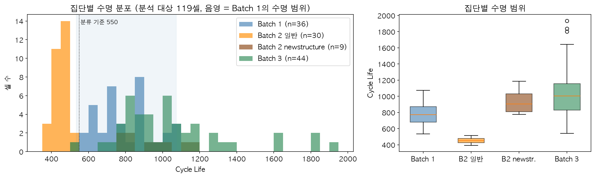
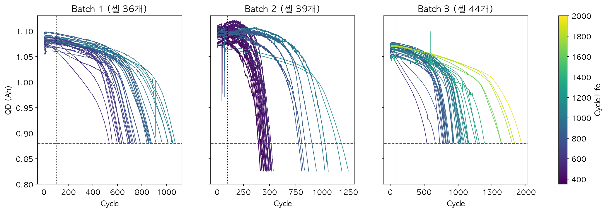
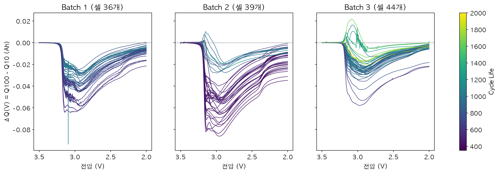
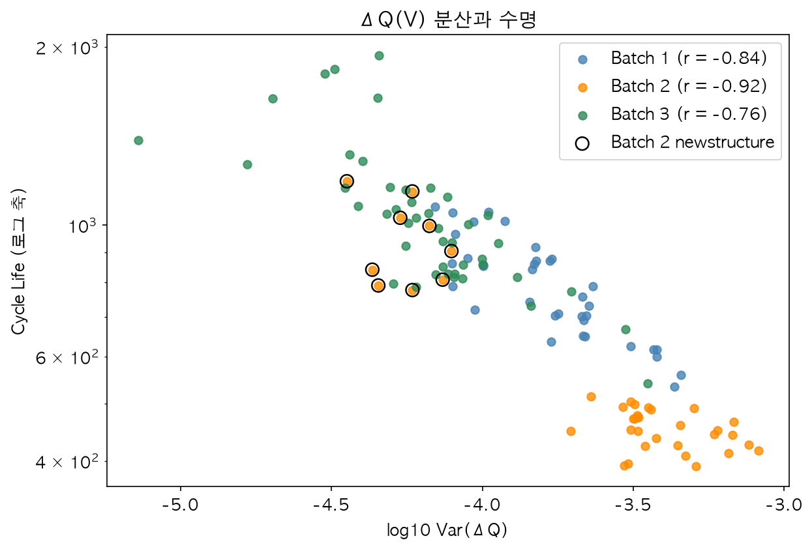
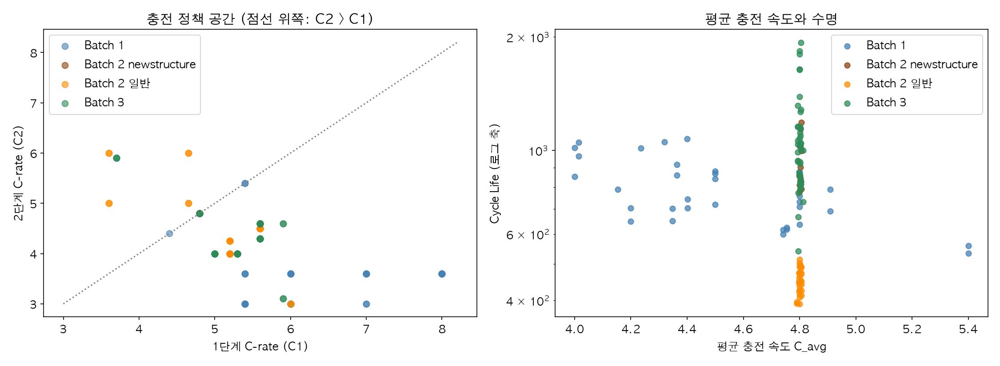
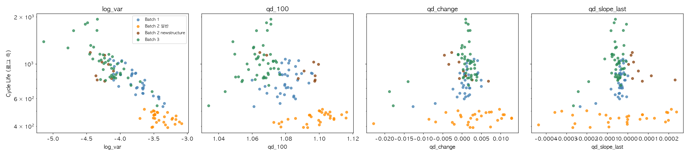

# ESS 배터리 수명 예측

초기 100사이클의 측정 데이터만으로 리튬이온 배터리 셀의 총 수명(cycle life)을 예측한다.
배터리 교체 비용은 ESS CAPEX의 30~40%를 차지하므로, 수명을 초기에 알 수 있으면 교체 시점을 미리 계획하고 셀을 선별할 수 있다.

> 진행 상태: EDA와 모델 설계(DAY 1) 완료. 모델 개발과 평가(DAY 2)는 진행 예정이며, 아래 "성능 결과", "오류 분석"은 평가 후 채운다.


## 프로젝트 개요

- 데이터셋 : MIT-Stanford Battery Dataset (Severson et al., Nature Energy 2019)
- 학습 데이터 : Batch 1 (2017-05-12)
- 평가 데이터 : Batch 2 (2018-02-20), 추가 평가 Batch 3 (2018-04-12)
- 태스크 : Regression (Cycle Life 예측), 타깃은 `log10(cycle_life)`
- 평가 지표 : MAPE (원 논문 9.1%와 비교)

| 역할 | 배치 | 전체 셀 | 분석 대상 | 수명 범위 | 수명 중앙값 |
|---|---|---:|---:|---:|---:|
| 학습 | Batch 1 | 46 | 36 | 534~1,074 | 772.5 |
| 평가 | Batch 2 | 47 | 39 | 392~1,186 | 472 |
| 추가 평가 | Batch 3 | 46 | 44 | 541~1,935 | 1,005.5 |

분석 대상은 수명 값이 있고, 마지막 방전 용량이 EOL(0.88Ah, 공칭 1.1Ah의 80%)에 도달한 것을 데이터로 확인한 셀이다.


## 파일 구조

```
├── data/                      # .mat 원본 (저장소에 포함하지 않음)
├── notebooks/
│   └── 01_EDA.ipynb           # 데이터 준비, 정제, EDA 질문 5개
├── results/
│   └── figures/               # EDA 그림
├── requirements.txt
└── README.md
```

DAY 2에 `src/`(전처리, 피처, 학습), 모델링 노트북, `results/model_performance.csv`를 추가한다.


## 환경 설정

```bash
git clone https://github.com/kyubin0973/DA-mini.git
cd DA-mini
python -m venv .venv && source .venv/bin/activate
pip install -r requirements.txt
```

Python 3.11에서 작업했다. 데이터는 [공식 배포 페이지](https://data.matr.io/1/projects/5c48dd2bc625d700019f3204)에서 `.mat` 파일을 받아 `data/`에 둔다.


## EDA

전체 과정과 수치는 [notebooks/01_EDA.ipynb](notebooks/01_EDA.ipynb)에 있다.

### 데이터 정제

- Batch 1의 46셀 중 10셀은 EOL에 도달하지 않은 채 시험이 끝났다. 마지막 용량이 0.913~1.043Ah이고, 기록된 `cycle_life`가 측정 사이클 수 + 1과 같았다. 수명이 아니라 시험 종료 시점이므로 제외했다.
- 방전 용량은 0.8~1.15Ah 밖의 59행과, 주변 11사이클 중앙값에서 0.04Ah 넘게 벗어난 11행을 제외했다. 두 기준 모두 값이 없는 빈 구간 안에 두었다.
- ΔQ(V) 곡선에는 전압 축 9포인트 중앙값 필터를 적용했다.
- 핵심 발견 : **제공된 수명 값을 그대로 쓸 수 없다. 검증을 통과한 분석 대상은 119셀이다.**

### Cycle Life 분포



- 세 배치의 분포가 다르다(중앙값 772.5 / 472 / 1,005.5).
- Batch 2는 두 집단의 혼합이다. 일반 30셀은 392~514, `newstructure` 9셀은 777~1,186으로 범위가 겹치지 않는다.
- 분류 기준 550사이클 미만인 셀이 Batch 1에는 36셀 중 1개, Batch 2에는 39셀 중 30개다.
- 핵심 발견 : **평가 배치의 일반 30셀은 전부 학습 배치의 수명 범위 밖에 있다.** 분류는 학습할 수 없고, 학습 범위 밖을 예측할 수 있는 회귀 모델이 필요하다.

### 열화 곡선 분석



- 열화 속도는 일정하지 않다. knee 이후 약 9~11배 빨라진다.
- knee는 수명의 약 70% 지점에 있다(배치별 중앙값 0.71 / 0.69 / 0.76). 가장 이른 knee가 243사이클이다.
- 초기 100사이클의 용량 변화는 중앙값 +0.0014~+0.0024Ah로 사이클 간 변동 수준이다.
- 핵심 발견 : **초기 100사이클의 용량 값에는 수명 신호가 없다.** 용량의 크기가 아니라 방전 곡선의 모양 변화에서 신호를 찾아야 한다.

### ΔQ(V) 곡선 분석





- ΔQ(V) = Q₁₀₀(V) − Q₁₀(V). 수명이 짧은 셀일수록 곡선이 깊게 파인다.
- `log10 Var(ΔQ)`와 `log10(수명)`의 상관이 Batch 1 −0.84, Batch 2 일반 −0.38, Batch 3 −0.76이다.
- 관계는 로그-로그 직선이고 기울기가 배치별로 −0.300 / −0.328 / −0.304로 같다.
- Batch 2 일반 30셀은 같은 기울기로 평행하게 내려와 있다. 실제 수명이 Batch 1 직선 예측의 약 76%다. 이 집단은 휴지 시간이 약 5분으로 Batch 1(약 1분)과 다르다.
- 핵심 발견 : **`log Var(ΔQ)`는 배치를 넘어 같은 기울기를 유지하지만 절편이 다르다. Batch 1로 학습한 모델은 Batch 2 일반 셀에서 약 31% 과대예측할 것으로 예상한다.**

### 충전 속도(C-rate)와 수명의 관계



- 평균 충전 속도가 다양한 것은 Batch 1뿐이다(4.00~5.40C). 나머지 집단은 4.79~4.81C로 사실상 고정이다.
- Batch 1에서 평균 충전 속도와 수명의 상관은 −0.59이지만, 가장 빠른 두 셀을 빼면 −0.45다.
- 같은 평균 충전 속도에서 수명이 약 390~1,930으로 5배 가까이 차이 난다.
- 핵심 발견 : **"고속 충전 셀이 수명이 짧다"는 Batch 1 안에서만 확인된다.** 충전 조건은 평가 배치에서 셀을 구분하지 못하므로 피처로 쓰지 않는다.

### 상관관계와 다중공선성



- 초기 100사이클로 만든 피처 16개를 세 기준으로 판정했다: 학습 배치에서의 상관, 다른 집단 안에서의 방향, 집단 사이의 관계.
- 충전 속도와 충전 시간은 Batch 1에서 상관이 높지만 다른 집단에서 부호가 다르다. `qd_100`은 집단 안에서는 양의 상관인데 집단 사이에서는 관계가 반대다.
- ΔQ 피처끼리는 상관이 0.98~1.00이다.
- 핵심 발견 : **세 기준을 모두 통과한 것은 ΔQ 피처뿐이고, 그중 하나만 쓰면 된다.**


## Modeling

### 피처 엔지니어링 전략

| 피처 | 판정 | 근거 |
|---|---|---|
| `log_var` = log10 Var(Q₁₀₀ − Q₁₀) | 채택 | 상관이 가장 강하고 세 집단에서 방향과 기울기가 같다 |
| `qd_slope_last` (91~100사이클 용량 기울기) | 후보 | 부호가 일관되고 `log_var`와의 중복이 중간 수준(−0.50). 교차검증에서 나아질 때만 추가 |
| `log_min`, `log_mean` | 제외 | `log_var`와 같은 정보(0.98~1.00) |
| 용량 수준, 용량 변화 | 제외 | 집단 사이에서 관계가 반대이거나 잡음 수준 |
| 충전 정책, 충전 시간 | 제외 | 평가 배치에서 변동이 없고 집단마다 방향이 다름 |
| 온도, 내부 저항 | 제외 | 상관이 약하고 측정 오류와 결측이 있음 |

### 모델 선택 및 근거

- 후보 모델 : 선형 회귀(기준선), Ridge, LASSO. Random Forest와 XGBoost는 외삽 점검의 대조군으로만 쓴다.
- 최종 모델 : DAY 2에 Batch 1 교차검증으로 결정
- 선택 이유 : 피처와 수명의 관계가 로그-로그 직선이고, 평가 셀의 다수가 학습 범위(534~1,074) 밖에 있다. 트리 계열은 학습 타깃의 범위 밖 값을 출력할 수 없다. 학습 셀이 36개여서 피처는 1~2개로 제한한다.
- 검증 방법 : 충전 정책 단위로 Hold-out 약 25%를 분리하고, 나머지에서 정책 단위 GroupKFold(5). 같은 정책의 셀이 양쪽에 나뉘면 누수가 생기기 때문이다. Batch 2는 모델을 확정한 뒤 한 번만 평가한다.


## 성능 결과

DAY 2 평가 후 작성한다.

| 구분 | MAPE |
|---|---:|
| Train (CV) | |
| Valid (Hold-out) | |
| Test (Batch 2) | |
| Gap (Train − Valid) | |
| Gap (Valid − Test) | |
| Gap (Target 9.1% − Test) | |

MAPE와 함께 집단별 편향(전체가 치우친 정도)과 편향 제거 후 오차를 따로 보고한다.


## 오류 분석

DAY 2 평가 후 작성한다.

- 모델이 가장 크게 틀린 셀의 공통점
- 원인 가설 및 개선 방향


## ESS 도메인 해석

EDA 결과를 기준으로 한 해석이며, 평가 후 보완한다.

- 활용 : 10번째와 100번째 사이클의 방전 곡선 두 개로 계산하므로, 사용 초기에 셀을 선별하거나 교체 일정을 잡는 데 쓸 수 있다.
- 용량을 지켜보는 방식으로는 급격한 열화를 미리 알 수 없다. 용량 감소가 눈에 띄는 시점은 이미 수명의 약 70%가 지난 뒤다.
- 한계 : 시험 조건(휴지 시간)이 다른 집단에서 예측이 한쪽으로 치우친다. 과대예측은 교체 시점을 실제보다 늦게 잡는 방향의 오차다. 운전 조건이 학습 데이터와 다른 현장에 적용하려면 그 조건의 셀 데이터로 보정해야 한다.
- 휴지 시간이 수명 차이의 원인인지는 이 데이터로 확인할 수 없다. 시험 조건과 다른 배치 요인이 분리되지 않는다.


## 참고문헌

- Severson et al. (2019). Data-driven prediction of battery cycle life before capacity degradation. *Nature Energy*, 4, 383–391.


## 팀 구성

- 김규빈 (울산 2반) : EDA, 피처 엔지니어링, 모델 개발, 성능 평가
